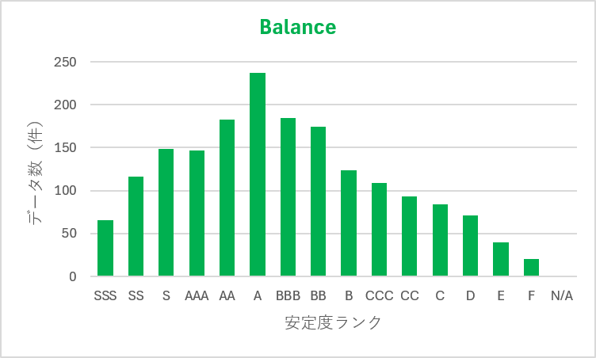
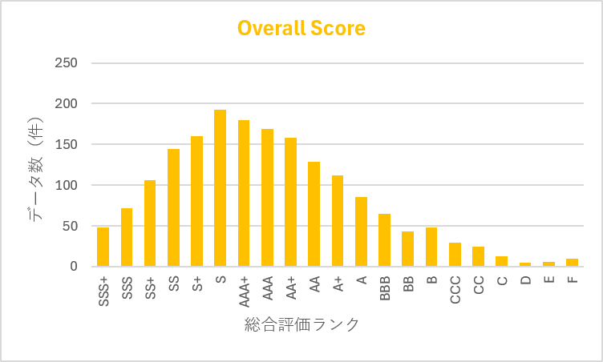
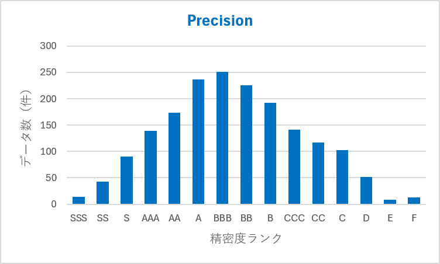
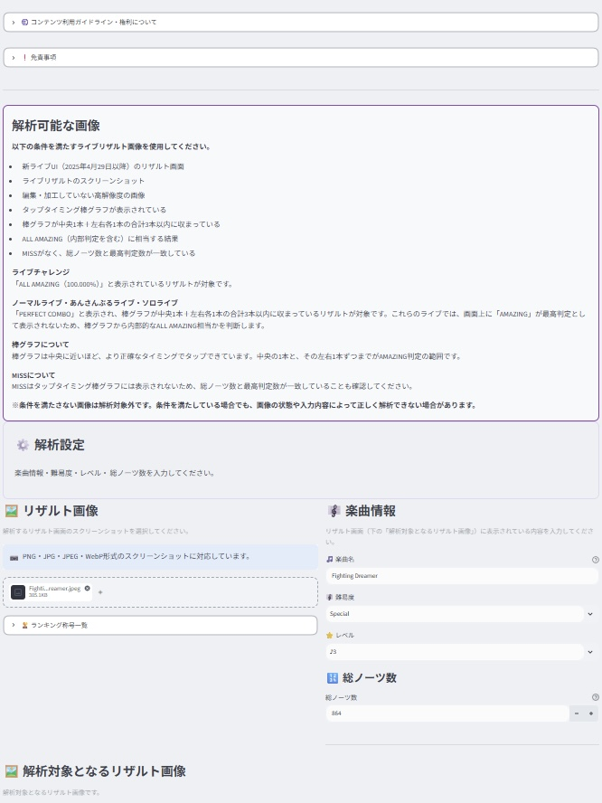
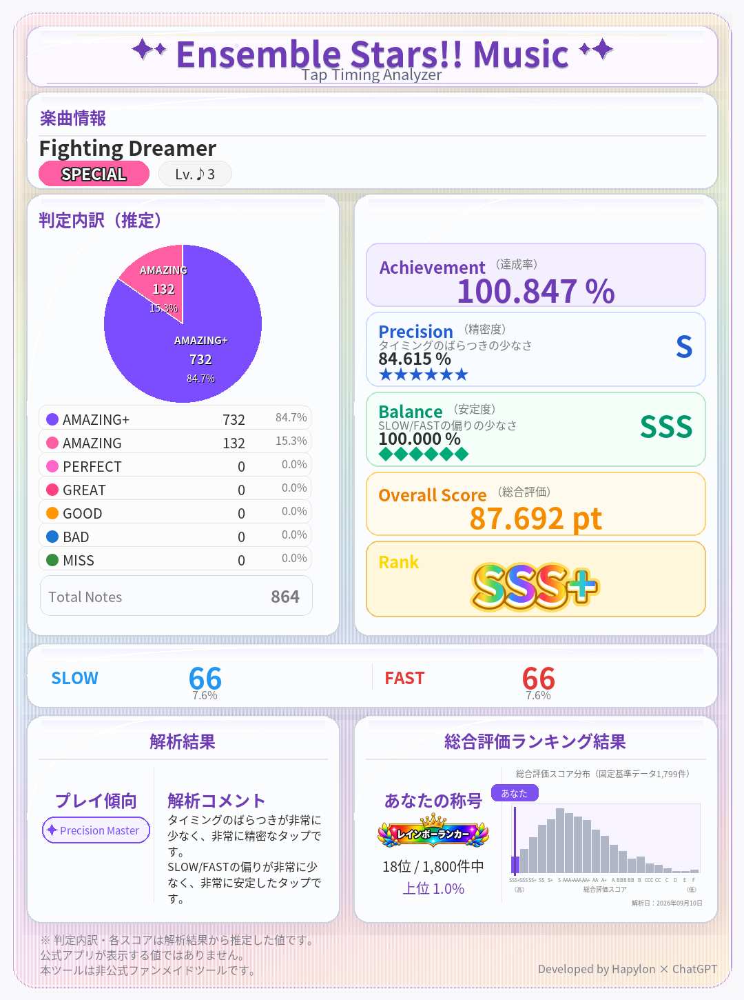
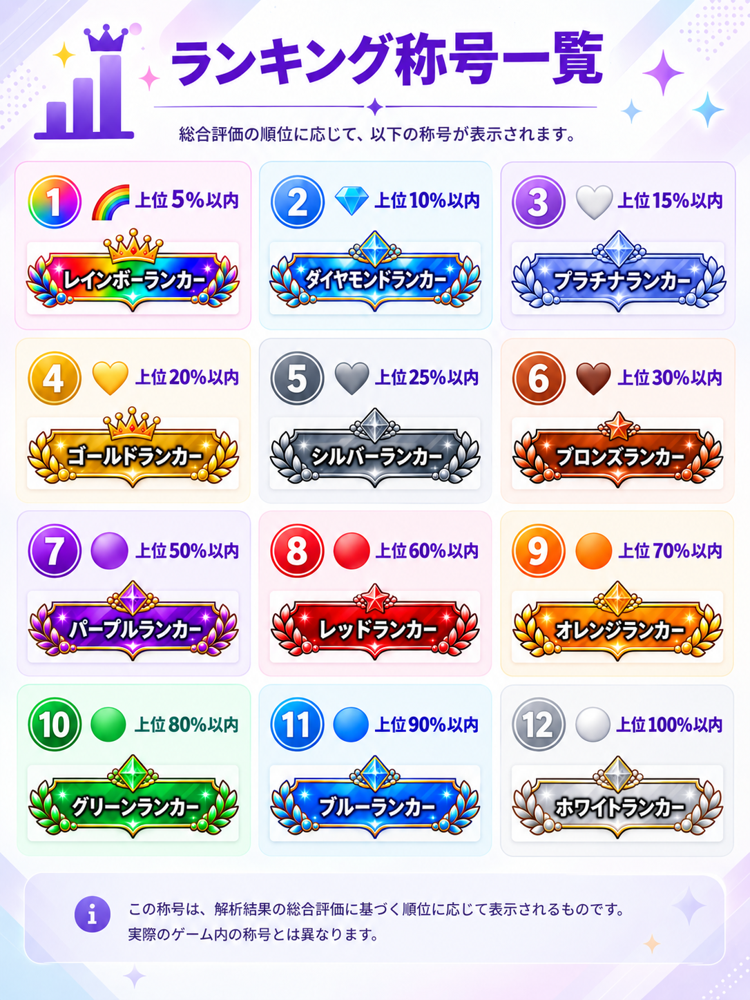

# あんさんぶるスターズ！！Music タップタイミング解析マニュアル

**あんさんぶるスターズ！！Musicのライブリザルト画面から、タップタイミングの傾向を詳しく確認できる非公式ファンツールです。**

リザルト画像をアップロードし、楽曲情報を入力するだけで、判定分布の推定、Precision、Balance、Overall Score、Rank、ランキングなどを確認できます。

> ⚠️ 本ツールは非公式ファンメイドツールです。  
> Happy Elements株式会社とは関係ありません。

---

## 🌟 Webアプリ

**Webアプリ：**

https://ensemble-stars-analyzer.streamlit.app/

現在、無料で利用でき、会員登録は必要ありません。

スマートフォン・タブレット・PCのブラウザから利用できます。

---

# 📖 まず最初に

このマニュアルでは、**実際にアプリを使う手順**を中心に説明します。

特に初めて利用する場合は、次の順番で確認してください。

1. 解析できるリザルト画像を用意する
2. リザルト画像をアップロードする
3. 楽曲名・難易度・レベル・総ノーツ数を入力する
4. 「解析開始」を押す
5. 解析結果を確認する
6. リザルトカードを保存する
7. 必要に応じてXで共有する
8. 総合評価ランキングとランキング称号を確認する

---

# 🎮 1．解析できるリザルト画像

解析する前に、使用するスクリーンショットが条件を満たしているか確認してください。

## 対応しているリザルト

現在の対象は、**新ライブUI（2025年4月29日以降）のライブリザルト画面**です。

対応しているライブは以下です。

- ライブチャレンジ
- ノーマルライブ
- あんさんぶるライブ
- ソロライブ

ただし、ライブの種類によって対象となるリザルト表示が異なります。

### ライブチャレンジ

リザルト画面に、

**ALL AMAZING（100.000%）**

と表示されているリザルトが対象です。

### ノーマルライブ・あんさんぶるライブ・ソロライブ

リザルト画面に、

**PERFECT COMBO**

と表示されているリザルトが対象です。

これらのライブでは画面上に「AMAZING」が最高判定として表示されないため、タップタイミング棒グラフから内部的なALL AMAZING相当かを判断します。

---

## 画像の条件

次の条件をすべて満たす画像を使用してください。

- ゲーム内のライブリザルト画面のスクリーンショット
- 新ライブUI（2025年4月29日以降）
- 編集・加工していない画像
- 十分な解像度がある画像
- タップタイミング棒グラフがはっきり表示されている
- 棒グラフが中央1本＋左右各1本の合計3本以内に収まっている
- ALL AMAZING相当の結果
- MISSがない
- 総ノーツ数と最高判定数が一致している

### 棒グラフを見るときのポイント

タップタイミング棒グラフは、**中央に近いほど正確なタイミング**を表します。

対象となるAMAZING判定の棒は、

- 中央
- 中央の左
- 中央の右

の最大3本です。

棒グラフが途中で切れている、ぼやけている、加工されている画像では、正しく解析できない場合があります。

### MISSについて

MISSはタップタイミング棒グラフには表示されません。

そのため、リザルト画面を見て、

**総ノーツ数と最高判定数が一致していること**

も確認してください。

> ⚠️ 条件を満たさない画像は解析対象外です。  
> 条件を満たしていても、画像の状態によって正しく解析できない場合があります。

---

# 📷 2．リザルト画像をアップロードする

Webアプリを開くと、リザルト画像をアップロードする欄があります。

対応している画像形式は、

- PNG
- JPG
- JPEG
- WebP

です。

画像をアップロードすると、入力画面の下に**「解析対象となるリザルト画像」**としてアップロードした画像が表示されます。

アップロードした画像を見て、正しいリザルト画像になっていることを確認してください。

### ファイルサイズ

アップロードできる画像は**最大20MB**です。

20MBを超える画像は解析できません。

---

# 🎼 3．楽曲情報を入力する

画像をアップロードしたら、画像に表示されている楽曲情報を入力します。

## 楽曲名

ゲームのリザルト画面に表示されている曲名を入力してください。

最大**50文字**まで入力できます。

---

## 難易度

以下から選択します。

- Easy
- Normal
- Hard
- Expert
- Special

リザルト画面と同じ難易度を選択してください。

---

## レベル

選択した難易度に応じて、入力できるレベルが変わります。

| 難易度 | 選択できるレベル |
|---|---|
| Easy | 5～10 |
| Normal | 11～17 |
| Hard | 17～26 |
| Expert | 23、24、25、26、26+、27、27+、28、28+、29、29+、30、30+ |
| Special | 26、26+、27、27+、28、28+、29、29+、30、30+、31、31+、♪1～♪6 |

> ※ Expert・Specialでは「+」付きのレベルや「♪」表記のレベルも選択できます。

---

## 🔢 総ノーツ数

**ゲームのリザルト画面に表示されている総ノーツ数を、そのまま入力してください。**

入力範囲は、

**60～1800**

です。

総ノーツ数は非常に重要です。

本ツールでは、棒グラフから判定分布を推定したあと、その割合を入力された総ノーツ数に換算します。

そのため、総ノーツ数を間違えると、推定される判定数やAchievementなどの結果も正しくならない場合があります。

> ⚠️ 総ノーツ数は必ずリザルト画面の表示を確認して入力してください。

---

# ▶️ 4．解析を開始する

入力が終わったら、

**「▶ 解析開始」**

を押してください。

解析では、

1. リザルト画像を読み込む
2. タップタイミング棒グラフを解析する
3. 判定分布を推定する
4. 各種評価を計算する
5. リザルトカードを生成する
6. ランキングを計算する

という処理が行われます。

解析が完了すると、

**「✅ 解析が正常に完了しました。」**

と表示され、結果を確認できます。

---

# 📊 5．解析結果の見方

## 判定分布

リザルト画面のタップタイミング棒グラフから、判定数を推定します。

主に次の項目を確認できます。

- AMAZING+
- AMAZING
- PERFECT
- FAST
- SLOW

ここで表示される判定数は、**ゲーム内部の正式な判定データではなく、画像から推定した値**です。

そのため、ゲーム公式の内部データと完全に一致することを保証するものではありません。

---

## 🏆 Achievement

本ツール独自の達成率です。

表示は小数点以下3桁までです。

理論上の最大値は、

**101.000%**

です。

Achievementはゲーム公式のCHALLENGE RATE値ではありません。

---

## 🎯 Precision（精密度）

タップタイミングの**ばらつきの少なさ**を表す、本ツール独自の指標です。

数値が高いほど、中央付近にタップタイミングが集まっていると評価されます。

表示範囲：

**0～100%**

PrecisionにはS～Fのグレードも表示されます。

### Precisionのグレード

| Precision | グレード |
|---:|:---|
| 88%以上 | SSS |
| 86%以上 | SS |
| 84%以上 | S |
| 82%以上 | AAA |
| 80%以上 | AA |
| 78%以上 | A |
| 76%以上 | BBB |
| 74%以上 | BB |
| 72%以上 | B |
| 70%以上 | CCC |
| 68%以上 | CC |
| 64%以上 | C |
| 60%以上 | D |
| 56%以上 | E |
| 56%未満 | F |

---

## ⚖️ Balance（安定度）

SLOWとFASTの**偏りの少なさ**を表す、本ツール独自の指標です。

SLOWとFASTの割合が近いほど高く評価されます。

表示範囲：

**0～100%**

### Balanceのグレード

| Balance | グレード |
|---:|:---|
| 98%以上 | SSS |
| 94%以上 | SS |
| 88%以上 | S |
| 82%以上 | AAA |
| 74%以上 | AA |
| 64%以上 | A |
| 56%以上 | BBB |
| 48%以上 | BB |
| 42%以上 | B |
| 36%以上 | CCC |
| 30%以上 | CC |
| 24%以上 | C |
| 18%以上 | D |
| 12%以上 | E |
| 12%未満 | F |

---

## ⭐ Overall Score（総合評価）

PrecisionとBalanceをもとに算出する、本ツール独自の総合評価です。

数値が高いほど、総合的に良い結果として評価されます。

現在の評価では、

- Precision：80%
- Balance：20%

の割合でOverall Scoreを算出します。

---

## 🏅 Rank

Overall Scoreに応じて、本ツール独自のRankが決まります。

| Overall Score | Rank |
|---:|:---|
| 86以上 | SSS+ |
| 84～85.999 | SSS |
| 82～83.999 | SS+ |
| 80～81.999 | SS |
| 78～79.999 | S+ |
| 76～77.999 | S |
| 74～75.999 | AAA+ |
| 72～73.999 | AAA |
| 70～71.999 | AA+ |
| 68～69.999 | AA |
| 66～67.999 | A+ |
| 64～65.999 | A |
| 62～63.999 | BBB |
| 60～61.999 | BB |
| 58～59.999 | B |
| 56～57.999 | CCC |
| 54～55.999 | CC |
| 52～53.999 | C |
| 50～51.999 | D |
| 48～49.999 | E |
| 0～47.999 | F |

> ⚠️ Rankは本ツール独自の評価です。ゲーム公式のランクではありません。

---

# 📈 6．1799件の基準データの分布

本ツールのランキングで使用している**1,799件の基準データ**について、Overall Score、Precision、Balanceの分布を参考として掲載しています。

これらのグラフは、基準データの各評価ランクに何件の結果が含まれているかを示したものです。

## ⚖️ Balance（安定度）の分布

1799件の基準データにおけるBalanceランク別の分布です。

  

---

## ⭐ Overall Score（総合評価）の分布

1799件の基準データにおけるOverall Scoreランク別の分布です。

  

---

## 🎯 Precision（精密度）の分布

1799件の基準データにおけるPrecisionランク別の分布です。

  

---

# 🖼️ 7．リザルトカード

解析が完了すると、解析結果をまとめたリザルトカードが表示されます。

リザルトカードには、主に以下の情報がまとめられています。

### 楽曲情報

- 楽曲名
- 難易度
- レベル

### 判定情報

- AMAZING+
- AMAZING
- PERFECT
- GREAT
- GOOD
- BAD
- MISS

### 評価

- Achievement
- Precision
- Precisionグレード
- Balance
- Balanceグレード
- Overall Score
- Rank

### SLOW / FAST

リザルトカード下部には、

**SLOW / FAST**

をまとめて表示します。

それぞれのノーツ数と、全判定数に対する割合を確認できます。

### プレイ傾向

Precision、Balance、SLOW / FASTなどをもとに、現在のプレイ傾向を確認できます。

### 解析コメント

解析結果をもとに、プレイ傾向や評価についてのコメントが表示されます。

### 総合評価ランキング

リザルトカードには、今回の結果について、

- 順位
- 上位何%か
- ランキング称号
- Overall Scoreの分布
- 現在の自分の位置

などを確認できるランキング結果も含まれます。

---

# 💾 8．リザルトカードを保存する

解析結果の下にある、

**「📥 リザルトカードを保存」**

を押すと、リザルトカードをPNG画像として保存できます。

保存されるファイル名は、

`楽曲名_ResultCard.png`

という形式です。

保存した画像は、SNSなどで共有できます。

---

# 𝕏 9．Xで解析結果を共有する

解析結果の下には、

**「𝕏 結果を共有」**

ボタンがあります。

このボタンを押すと、解析結果をもとにしたX投稿画面を開けます。

## 投稿される主な情報

- 楽曲名
- 難易度
- レベル
- AMAZING+
- AMAZING
- FAST
- SLOW
- Achievement
- Precision
- Balance
- Overall Score
- Rank
- ランキング順位
- 上位○%
- WebアプリURL
- ハッシュタグ

### 曲名について

X投稿では曲名を最大20文字まで使用します。

投稿全体が250文字を超える場合は、投稿全体が収まるように曲名がさらに短縮されます。

長い曲名は末尾が「…」になります。

### 画像について

X共有機能は**解析結果をもとにした投稿文とWebアプリURLを作成する機能**です。

アップロードしたリザルト画像そのものをXへ自動投稿する機能はありません。

> ⚠️ Xへ投稿する前に、表示された投稿内容を確認してください。

---

# 🏆 10．総合評価ランキング

解析結果では、Overall Scoreをもとにした本ツール独自のランキングを確認できます。

ランキングは、

**固定された1,799件の基準データ**

と今回の解析結果を比較して計算します。

今回の解析結果を加えると、画面上では、

**1,800件**

として表示されます。

### ランキングの見方

ランキング画面では、

- 順位
- Overall Score
- Rank
- Precision
- Balance
- プレイ傾向

などを確認できます。

現在の解析結果には、

**★あなた**

と表示されます。

### ページ

ランキングは1ページ50件で表示され、

**全36ページ**

あります。

ページ番号を入力して移動したり、「前のページ」「次のページ」で移動したりできます。

### ランキングデータについて

今回の解析結果は、ランキング基準データへ保存・追加されません。

つまり、同じ結果を何度解析しても、それによってランキング基準データ自体が増える仕組みではありません。

ランキングは固定された基準データとの比較結果として表示されます。

### ランキングの基準日

現在のランキング基準データは **2026年8月25日時点** のデータです。

ランキングは今後のデータ追加・更新によって変動する可能性があります。

> ⚠️ このランキングは本ツール独自のランキングです。  
> 『あんさんぶるスターズ！！Music』公式のランキングではありません。

---

# 🏅 11．ランキング称号

ランキング順位の**上位率（%）**に応じて、本ツール独自のランキング称号が決まります。

**上位率は数値が小さいほど上位**です。  
たとえば「上位10%」は、ランキング全体の上位10%以内を意味します。

現在の称号は以下の12種類です。

| 絵文字 | ランキング称号 | ボーダー（上位率） |
|:---:|---|---:|
| 🌈 | レインボーランカー | **上位5%以内** |
| 💎 | ダイヤモンドランカー | **上位10%以内** |
| 🤍 | プラチナランカー | **上位15%以内** |
| 💛 | ゴールドランカー | **上位20%以内** |
| 🩶 | シルバーランカー | **上位25%以内** |
| 🤎 | ブロンズランカー | **上位30%以内** |
| 🟣 | パープルランカー | **上位50%以内** |
| 🔴 | レッドランカー | **上位60%以内** |
| 🟠 | オレンジランカー | **上位70%以内** |
| 🟢 | グリーンランカー | **上位80%以内** |
| 🔵 | ブルーランカー | **上位90%以内** |
| ⚪ | ホワイトランカー | **上位100%以内** |

### 称号の決まり方

上位率を上位から順に判定し、最初に該当するボーダーの称号が表示されます。

たとえば、

- **上位4.0%** → 🌈 レインボーランカー
- **上位7.5%** → 💎 ダイヤモンドランカー
- **上位14.0%** → 🤍 プラチナランカー
- **上位18.0%** → 💛 ゴールドランカー
- **上位24.0%** → 🩶 シルバーランカー
- **上位29.0%** → 🤎 ブロンズランカー
- **上位45.0%** → 🟣 パープルランカー
- **上位55.0%** → 🔴 レッドランカー
- **上位65.0%** → 🟠 オレンジランカー
- **上位75.0%** → 🟢 グリーンランカー
- **上位85.0%** → 🔵 ブルーランカー
- **上位95.0%** → ⚪ ホワイトランカー

という判定になります。

> ⚠️ ランキング称号は本ツール独自のものです。  
> 『あんさんぶるスターズ！！Music』公式の称号・ランキングではありません。

> 📌 ランキングの基準データは固定されています。  
> 現在は1,799件の基準データと今回の解析結果を比較し、画面上では1,800件として表示します。

# 📷 12．実際の画面

実際のWebアプリの画面やリザルトカードを紹介します。

## Webアプリ入力画面

リザルト画像をアップロードし、楽曲名・難易度・レベル・総ノーツ数を入力する画面です。

  

---

## 解析結果・リザルトカード

解析完了後に表示されるリザルトカードです。

判定分布、Achievement、Precision、Balance、Overall Score、Rank、SLOW / FAST、ランキングなどをまとめて確認できます。

  

---

## ランキング称号一覧

ランキングの上位率に応じて表示される12種類のランキング称号です。

  

---

# ✅ 13．利用前に特に確認してほしいこと

初めて利用する場合は、次の4点を確認すると解析に失敗しにくくなります。

1. **新ライブUI（2025年4月29日以降）のリザルト画像を使用する**
2. **タップタイミング棒グラフがはっきり見える画像を使用する**
3. **総ノーツ数をリザルト画面の表示どおりに入力する**
4. **画像を編集・加工せず、そのままアップロードする**

特に、総ノーツ数は推定された判定割合をノーツ数へ換算するために使用されます。入力を間違えると、判定数やAchievementなどの結果に影響します。

---

# ❓ 14．よくある質問

## Q．このツールは無料ですか？

はい。現在、無料で利用できます。

会員登録も必要ありません。

## Q．スマートフォンから利用できますか？

はい。

スマートフォンのブラウザからリザルト画像をアップロードして利用できます。

## Q．どんな画像でも解析できますか？

いいえ。

新ライブUIの対応リザルトで、タップタイミング棒グラフが明確に表示されている画像を使用してください。

特に、編集・加工された画像や解像度の低い画像では正しく解析できない場合があります。

## Q．総ノーツ数はなぜ入力するのですか？

棒グラフから推定した割合を、実際のノーツ数へ換算するためです。

リザルト画面に表示されている総ノーツ数をそのまま入力してください。

## Q．解析結果はゲーム公式の数値ですか？

いいえ。

本ツールがリザルト画像から独自に推定・算出した結果です。

ゲーム内部の正式な判定・評価・計算方法を取得または再現したものではありません。

## Q．ランキングは公式ランキングですか？

いいえ。

本ツール独自の1,799件の基準データを使用したランキングです。

## Q．ランキングに自分の結果は保存されますか？

いいえ。

今回の解析結果はランキング基準データへ保存・追加されません。

画面上で1,800件目として一時的に比較・表示されます。

## Q．X共有すると、リザルト画像も投稿されますか？

いいえ。

X共有では解析結果をもとにした投稿文とWebアプリURLを作成します。

アップロードした画像そのものをXへ自動投稿する機能はありません。

## Q．解析に失敗した場合はどうすればよいですか？

まず、次を確認してください。

1. 対応する新ライブUIのリザルトか
2. 対象となるライブ・リザルト条件を満たしているか
3. 棒グラフがはっきり表示されているか
4. 画像を加工していないか
5. 画像の解像度が十分か
6. 総ノーツ数が正しいか

条件を満たしていても、画像の状態などによって正しく解析できない場合があります。

---

# ⚠️ 15．ご利用上の注意

## 解析結果は推定値です

本ツールは、利用者が用意したリザルト画像を独自の方法で解析して結果を推定します。

ゲーム内部の正式な判定データを取得・改変するものではありません。

そのため、

- 判定分布
- Achievement
- Precision
- Balance
- Overall Score
- Rank
- ランキング

などは、本ツール独自の解析・評価結果です。

ゲーム公式の数値・評価・ランキングではありません。

## 入力内容を確認してください

特に総ノーツ数は解析結果に影響するため、入力間違いがないか確認してください。

## 個人情報に注意してください

アップロードする画像に、個人を特定できる情報などが含まれていないか、アップロード前に確認してください。

第三者が公開した画像を使用する場合は、第三者の権利や利用条件にも配慮してください。

---

# 🔒 16．プライバシーについて

本サービスでは、主に以下の情報を解析のために利用します。

- アップロードされたリザルト画像
- 入力された楽曲名
- 難易度
- レベル
- 総ノーツ数
- 解析によって生成された結果

アップロードされた画像は、解析および解析結果の表示のために一時的に取り扱います。

解析処理のために作成した一時ファイルは、処理後に削除する処理を行います。

本アプリには、アップロード画像や解析結果をユーザー履歴として継続的に保存する機能はありません。

また、解析結果をランキング基準データへ自動的に追加する機能もありません。

ただし、ブラウザやホスティング基盤側で行われるログ・キャッシュその他の取り扱いについては、本アプリの実装だけで保証するものではありません。

---

# 📜 17．利用規約・ガイドライン

本サービスの利用にあたっては、以下の点に注意してください。

- 不正な目的で利用しないでください。
- サービスへ過度な負荷を与える行為を行わないでください。
- 正常な動作を妨害する行為を行わないでください。
- 不正アクセスを試みないでください。
- 第三者の権利を侵害しないでください。
- サービスの運営を妨げる行為を行わないでください。

ゲームおよび関連する名称、画像、ロゴ、キャラクター等の権利は、それぞれの権利者に帰属します。

本ツールはそれらの権利を取得するものではありません。

サービス内容は、メンテナンス、障害、仕様変更その他の事情により変更または停止される場合があります。

---

# 🎮 非公式ファンメイドツールについて

本ツールは、

**『あんさんぶるスターズ！！Music』の非公式ファンメイドツールです。**

Happy Elements株式会社およびその関連会社等とは関係ありません。

『あんさんぶるスターズ！！Music』および関連する名称・コンテンツ等の権利は、それぞれの権利者に帰属します。

本ツールはゲーム公式の機能・サービスではありません。

